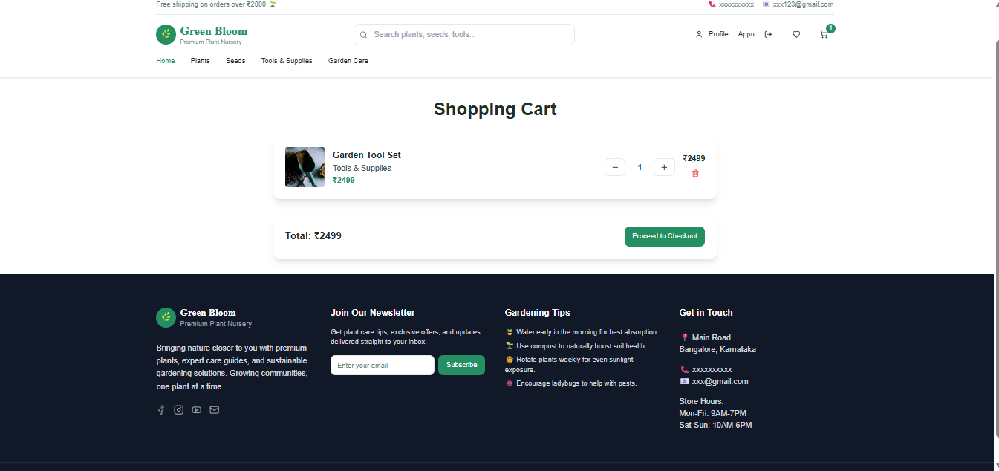
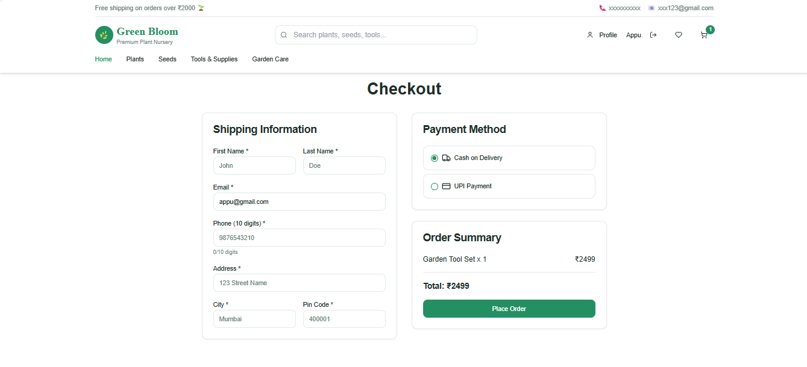
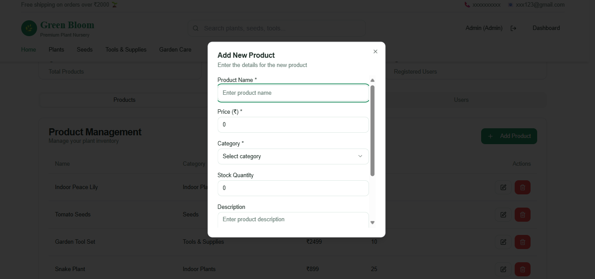
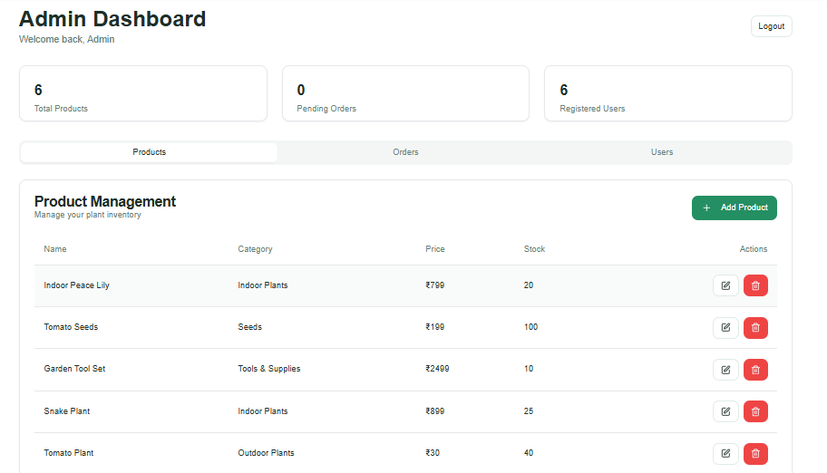

<p align="center">
  
</p>


# 🌿 Online Nursery Management System

A full-stack web application that allows users to browse, buy, and review plants and gardening tools. Admins can manage products, track orders, and oversee the system.

## 🧰 Features

- 👤 User authentication (Admin & Customer)
- 🛒 Shopping cart, wishlist, and product reviews
- 📦 Real-time stock tracking
- 🧑‍💻 Admin dashboard to add/edit/delete products
- 💬 Plant care chatbot
- 🌟 Product ratings & user feedback

## 🔐 Admin Login

- **Email:** admin098@gmail.com  
- **Password:** Admin@123

## Customer Login

 Sign up with your email & password

## 🛠️ Technologies Used

- **Frontend:** React, Tailwind CSS
- **Backend:** Node.js, Express
- **Database:** PostgreSQL
- **Auth:** JWT + bcrypt
- **Deployment:** (To be added)

## 🚀 Getting Started

1. Clone the repository  
   ```bash
   git clone https://github.com/ShivarajNKengannavar/ONLINE-NURSERY-MANAGEMENT-SYSTEM.git
   cd ONLINE-NURSERY-MANAGEMENT-SYSTEM

2. cd client
   npm install
   cd ../server
   npm install

3. Create a .env file from .env.example and configure your environment.

4. Start development servers - npm run dev

👨‍💻 Developer
Shivaraj N. Kengannavar
Email: shivarajnkengannavar@gmail.com


## 🙌 **Contributing**

We welcome contributions! Whether it’s reporting bugs, discussing improvements, or submitting pull requests — every bit helps!

1. Fork the repository
2. Create a new branch (`git checkout -b feature/YourFeature`)
3. Commit your changes (`git commit -m 'Add your message'`)
4. Push to the branch (`git push origin feature/YourFeature`)
5. Open a Pull Request


## 📸 Screenshots

### 👤 User Side

#### 🏠 Home Page


#### 🛒 Product Listing


#### 🔐 Payment Page



---

### 🛠️ Admin Side

#### 📦 Add Product


#### 📊 Dashboard



                              Thanks for stopping by! 🌿 Let’s grow something great together.


